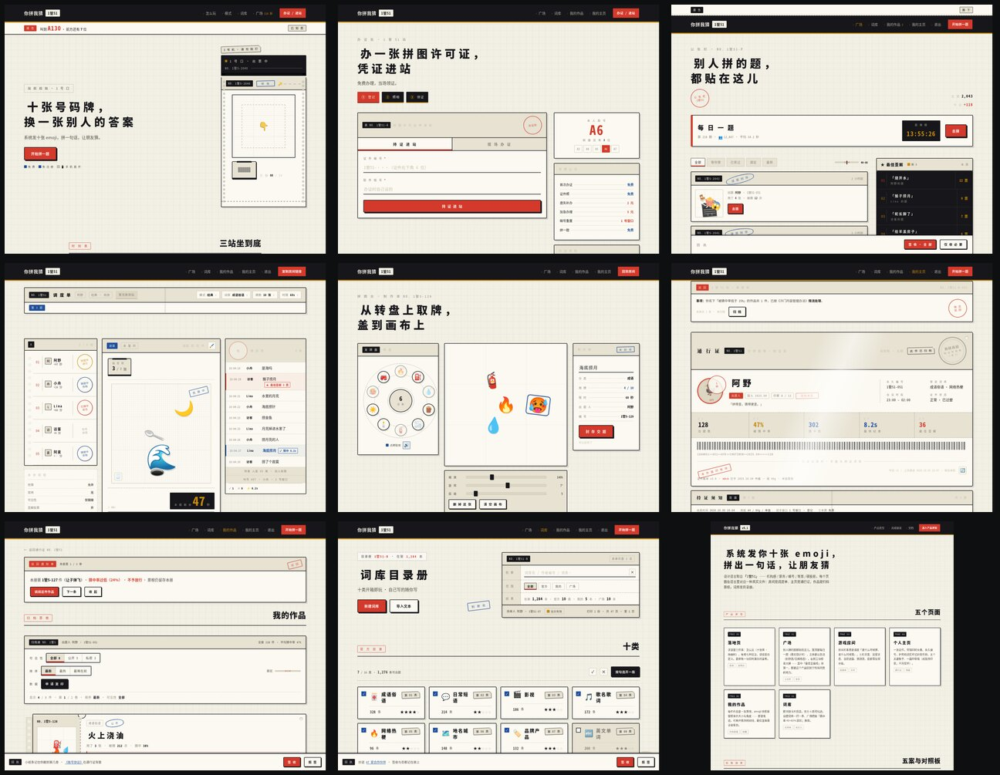

# 你拼我猜 · you-guess-my-stamping

> 系统发你十张 emoji，拼出一句话，让朋友猜。
> 一个网页派对游戏的产品设计原型。



---

## 这是什么

用 emoji 当画笔的猜谜游戏。系统随机发十张 emoji，你用几张随你（可以全用，也可以只用一张），
拖进画布、放大缩小旋转，拼出一个词、一个成语、一个梗。别人看着这堆 emoji 猜你拼的是什么。

**猜不中比猜中更好玩。** 猜歪的答案会被留档，榜上第一名的位置留给「最佳歪解」——
这是这个产品区别于所有同类的地方。

**仓库里是一个完整可点的原型**，不是设计稿。打开 `index.html` 就能一页页走完。

---

## 怎么看

不需要安装、不需要构建、没有依赖。直接打开：

```
index.html          ← 项目入口（列出全部页面与文档）
```

或者直接进任意一页：

| 页面 | 角色 | 文件 |
|---|---|---|
| 落地页 | 宣传招贴 | [`app/index.html`](app/index.html) |
| 办证处（登录/注册） | 申请表 + 取号 + 照相 + 盖章发证 | [`app/login.html`](app/login.html) |
| 广场 | 公告栏 | [`app/plaza.html`](app/plaza.html) |
| 游戏房间 | 调度单 | [`app/room.html`](app/room.html) |
| **拼图台** | **制作单（核心操作页）** | [`app/compose.html`](app/compose.html) |
| 个人主页 | 通行证 | [`app/me.html`](app/me.html) |
| 我的作品 | 装订成册的归档票根 | [`app/works.html`](app/works.html) |
| 词库 | 目录册 | [`app/banks.html`](app/banks.html) |
| 404 / 500 / 离线 / 满员 | 站台通告 | [`app/404.html`](app/404.html) 等 |

> **建议按顺序看**：落地页 → 办证处 → 广场 → 游戏房间 → **拼图台** → 我的作品 → 个人主页 → 词库。

### 几个值得试的交互

- **拼图台** —— 十张 emoji 挂在**自转转盘**上，点一张就"盖"到画布上（有盖章动效 + **Web Audio 合成的盖章声**），用过的牌**当场打孔**。选中后可拖拽，或拉三个**物理拨杆**调缩放/旋转/层级。
- **房间页**在谜面上**点右键** —— 柜台操作（撕票根 / 盖章 / 复印）
- **切到别的标签页**看标题栏变化
- **按 F12** 看控制台
- **登录页**点证件照那一格（会"照"出一张）
- **错误页**的"重试"按钮 —— 它不刷新

---

## 设计语言：「1管51」机构感

一套**票务机构**的视觉体系。三条硬规则：

**① 三色铁律** —— 全站只有三种彩色，永不加第四色。

```
墨黑 #17171B     印章蓝 #1F4E9C     印红 #D33A2C     （+ 琥珀 #C98A0E）
```

**② 材质规则** —— 深色 = 屏 / 牌，浅色 = 纸。

> 判据：**这东西能拿走吗？** 能 → 纸（票根、单据、名单）；不能 → 屏（榜单、时刻表、记分牌）。
> 深色是「这一页的仪表盘」，不是强调手段。

**③ 形态规则** —— 几乎全直角（最大 3px）。**唯一的圆是转盘与印章。**

### 两条扩展轴

**轴 A · 印章 = 状态系统**
> 一支产品需要多少种状态，就应该有多少枚章。

7 种形状（方 / 圆 / 椭圆 / 条形 / 钢印 / 火漆 / 骑缝）× 3 种功能色 × 3 种盖印状态（盖歪 / 缺墨 / 重影）。

**轴 B · 物理动作即交互**
机构里真实存在的**手部动作**，直接当交互——比任何图标都直观：

打孔（孔**永久留在纸上**）· 装订 · 撕线 · 折痕 · 过塑 · 红笔划掉（**不做橡皮擦**）· 贴标签 · 抽签 · 叫号

---

## 设计过程

用 **Double Diamond** 走的：Discover → Define → Develop → Deliver。
`docs/` 里是完整的推导记录，包括**走过的一条弯路**。

| 文档 | 内容 |
|---|---|
| [01 发现期](docs/01-discovery.md) | 五个随机种子字符串的解构、用户画像、五案风格对比 |
| [02 方向池 I](docs/02-style-directions.md) | 114 条零件级设计方向 |
| [03 产品结构](docs/03-product-structure.md) | 玩法模式、词库体系、信息架构、逐页定义 |
| [04 风格池 II](docs/04-style-directions-2.md) | 90 条设计流派 |
| [05 语言 v2](docs/05-language-v2.md) | ⛔ **已撤回**：曾把「网页官僚」当第二套体系加进来 |
| [06 语言 v3](docs/06-language-v3.md) | 回到 v1，然后往外长 |
| [07 简化律](docs/07-simplification.md) | 一次只说一件事 |

### 那条弯路值得单独说

v2 版本引入了荧光色、Cookie 条、验证码弹窗这套「互联网平台」语言。
它**好看、有梗、也真的好玩**——但它打破了 v1 的三色铁律，而那正是这套语言最强的约束。

判断标准最后落在这一句：

> **这东西还是同一套物料吗？**
>
> **扩展**是从已有物料里长出新的（印章本来就在，只是没刻那么多枚；手部动作本来就有，只是没做成交互）。
> **融合**是把另一套东西搬进来。前者让语言变厚，后者让语言变糊。

v2 已全部撤回，文档保留作为设计史存档。

---

## 简化：6357 → 3603 字

原型堆到第三轮时臃肿了，做了一次全站减法：

| 指标 | 前 | 后 |
|---|---|---|
| 中文字 | 6357 | **3603**（−43%）|
| 提示类小字 | 188 | **60**（−68%）|
| 印章 | 50 | **28**（−44%）|
| 页脚重复导航 | 30 条 | **0** |

五条定律，核心判据只有一个：

> 这行字是「**单据上本来就有的**」（编号 / 日期 / 金额 / 条款 = 内容），
> 还是「**设计者加来解释的**」（说明）？
>
> **前者留，后者删。** 《持证须知》12 条正文一个字没删。

---

## 技术说明

- **纯静态 HTML + 内联 CSS/JS**，没有构建步骤、没有依赖、**零外部资源**
- 所有图标用 emoji，所有插图用 CSS 画
- 共享设计系统 [`app/base.css`](app/base.css) 是唯一真相源；各页 `<style>` 只写本页版面，**不重定义共享零件**
- 音效用 **Web Audio API 合成**（不加载任何音频文件）

### 目录

```
.
├─ index.html          项目入口
├─ app/                产品原型（11 页 + 设计系统）
│   ├─ base.css        设计系统（唯一真相源）
│   └─ *.html          各页面
├─ docs/               设计推导（7 篇）
├─ landing/            早期风格探索存档（五案 + 对照板）
└─ preview/            截图
```

---

## 版权

原型里出现的店名、编号、榜单数据均为虚构。
